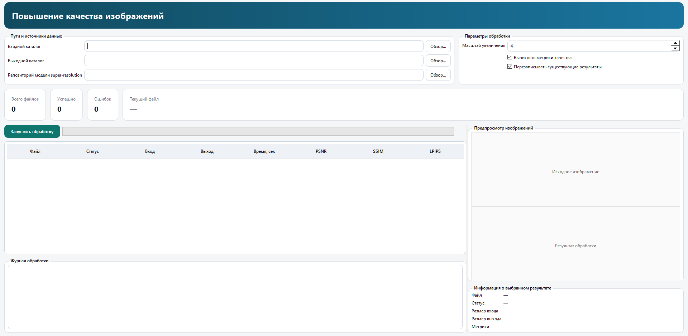
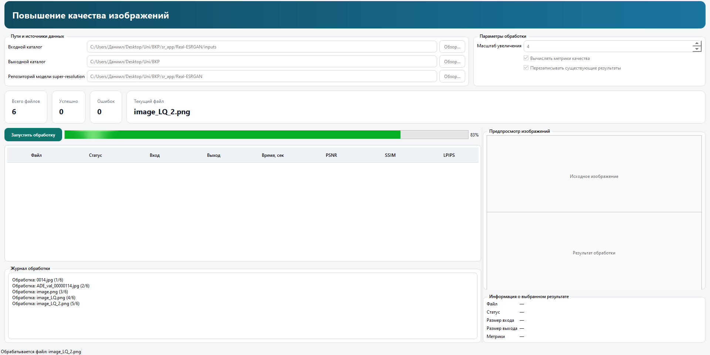
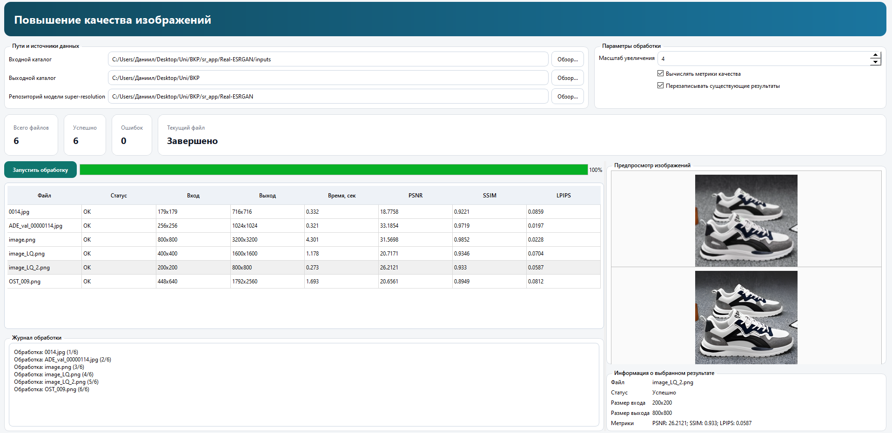
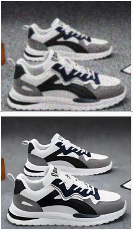

# SR

## Структура
- `src/app` — точка входа
- `src/gui` — пользовательский интерфейс
- `src/controllers` — контроллер приложения
- `src/core/io` — работа с файлами
- `src/core/preprocess` — предобработка изображений
- `src/core/sr` — интеграция super-resolution
- `src/core/metrics` — расчет метрик
- `src/core/save` — сохранение результатов
- `src/models` — DTO и модели данных
- `src/config` — настройки
- `src/utils` — логирование и утилиты

## Запуск

```bash
pip install -r requirements.txt
python src/app/main.py
```

## Описание метрик:

`PSNR` - MSE между исходным и обработанным изображением. Чем выше PSNR, тем меньше среднеквадратичная ошибка. Измеряется в децибелах; для хороших SR‑результатов обычно ожидают 25–30 dB и выше.

`SSIM` - Оценивает сходство по структуре, яркости и контрасту; диапазон от −1 до 1. Значение ближе к 1 означает высокое структурное сходство.

`LPIPS` - Среднее абсолютное отличие нормированных пикселей между изображениями. Чем меньше значение, тем ближе изображения по восприятию.

## GUI

`Интерфейс программы:`







`Пример 1`



`Пример 2`

